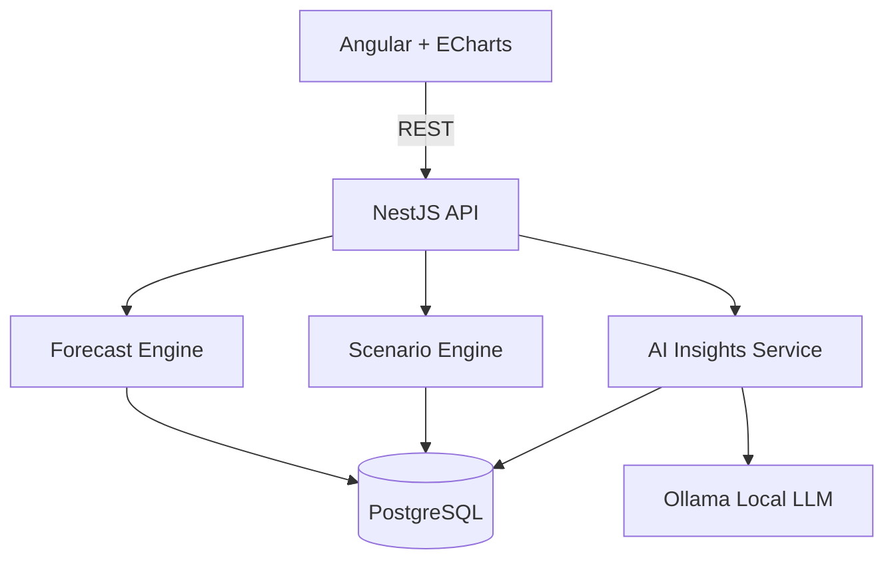
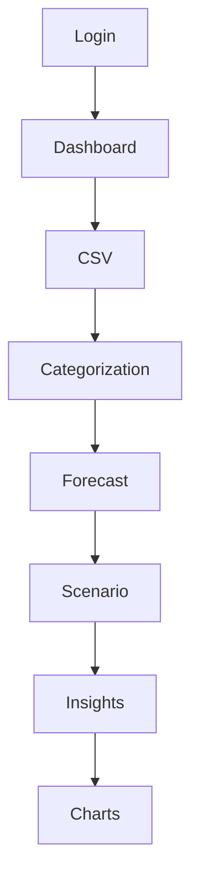
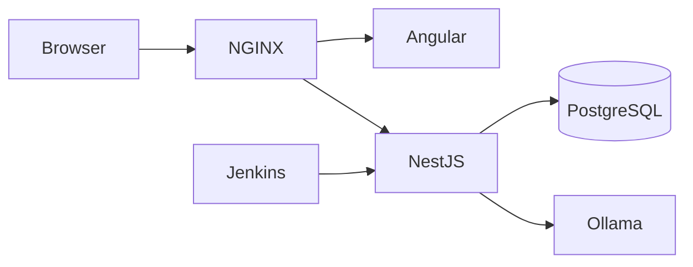

# FutureFlow

**Predictive Cash Flow & Scenario Planner**

FutureFlow is a personal finance forecasting platform focused on predictive cash-flow analysis, scenario planning, AI-assisted financial insights, recurring expense tracking, and goal-based saving.

> **Status:** Design / documentation baseline. Application source is not implemented yet. Behavior described below comes from the documents in [`docs/`](docs/).

---

## Project goals

From the [System Architecture](docs/FutureFlow_System_Architecture_v1.0.docx) document:

- Predict future cash flow for **6–12 months**
- Forecast long-term financial health over **5–10 years**
- Support real-time **what-if** scenario planning
- Automatically categorize transactions
- Provide AI-generated financial insights using a **local LLM**
- Track recurring subscriptions
- Support adaptive savings envelopes
- Use **only** free/open-source technologies

---

## Proposed technology stack

From the System Architecture technology stack (also reflected in the [Deployment Guide](docs/FutureFlow_Deployment_Guide_v1.0.docx)):

| Layer | Technology |
| --- | --- |
| Frontend | Angular, TypeScript, Angular Material, Apache ECharts |
| Backend | Node.js, NestJS, TypeScript |
| Database | PostgreSQL + Prisma ORM |
| Authentication | JWT + Argon2/bcrypt |
| AI | Ollama + open-source LLM |
| Infrastructure | Docker, Docker Compose, Jenkins, NGINX, GitHub |

Deployment components named in the Deployment Guide:

| Component | Technology |
| --- | --- |
| Frontend | Angular |
| Backend API | NestJS (Node.js) |
| Database | PostgreSQL |
| AI service | Ollama |
| Reverse proxy | NGINX (production) |
| CI/CD | Jenkins |
| Container runtime | Docker & Docker Compose |

Constraint: free/open-source technologies only. The complete application is intended to run locally with Docker Compose without paid cloud services ([Non-Functional Requirements](docs/FutureFlow_Non-Functional_Requirements_v1.0.docx)).

---

## How it helps

Mapped to documented goals, functional requirements, and [user stories](docs/FutureFlow_User_Stories_v1.0.docx):

| Need | Documented capability |
| --- | --- |
| See near-term cash position | 6–12 month cash-flow forecast; dashboard shows balances, forecast, and insights |
| Plan further out | 5–10 year projection |
| Compare life changes safely | What-if scenarios (for example salary changes or a new mortgage) saved without modifying baseline data |
| Avoid manual data entry | Import CSV from a bank; CRUD transactions |
| Spot recurring costs | Subscription manager detects recurring charges and identifies price increases |
| Save toward targets | Goal envelopes with dynamic monthly recommendations |
| Get guidance without cloud AI | Local AI insights, with rule-based fallback if AI is unavailable |
| Stay ready for shortfalls | Negative balance / cash crunch alerts |

Financial calculations are deterministic and separate from AI suggestions ([AI Integration Design](docs/FutureFlow_AI_Integration_Design_v1.0.docx), [Forecasting Engine Design](docs/FutureFlow_Forecasting_Engine_Design_v1.0.docx)).

---

## How it works

### High-level architecture

Layered design separating presentation, business logic, forecasting, AI orchestration, and persistence ([System Architecture](docs/FutureFlow_System_Architecture_v1.0.docx)):



| Component | Role |
| --- | --- |
| **Angular client** | Dashboard, visualization, CSV upload, goal management, scenario editing |
| **NestJS API** | Authentication, business logic, forecasting orchestration, REST endpoints |
| **Forecast engine** | Cash-flow projection, recurring expenses, net worth, goal calculations |
| **Scenario engine** | Life-event simulations without modifying baseline data |
| **AI insights** | Transaction categorization and natural-language observations |
| **PostgreSQL** | Users, accounts, transactions, forecasts, and scenarios |

### Documented user workflow

From [Functional Requirements](docs/FutureFlow_Functional_Requirements_v1.0.docx):



### Forecast engine (summary)

From the Forecasting Engine Design:

1. Load account balances, recurring transactions, goals, and forecast settings
2. Build months for the selected forecast window
3. Apply projected income, then expenses / subscriptions / debt payments / transfers
4. Apply recommended goal contributions when cash allows
5. Calculate surplus/deficit and ending balance; carry balance forward
6. Flag cash-crunch months (default threshold: ending balance below $0)
7. Return chart-ready JSON for Angular / Apache ECharts

Simplified monthly model:

```text
Ending Balance = Starting Balance + Projected Income - Projected Expenses - Goal Contributions +/- Scenario Adjustments
```

Scenarios are overlays on the baseline. Example types in the design: income change, new expense, contribution change, subscription cancellation, one-time event.

### AI integration (summary)

From the AI Integration Design:

- **Local-first:** Ollama runs open-source models locally; NestJS validates structured responses
- **Optional:** deterministic rules run first; AI assists unresolved / low-confidence cases
- **Fallback:** rule-based categorization if Ollama is offline
- **User control:** users can override AI categories
- **Scope (initial):** categorization and spending insights (high); subscription support and goal recommendations (medium); conversational assistant (future)
- Insights are labeled as suggestions/observations, not financial advice
- Forecasts and scenarios must not depend on AI output

### Data model (summary)

Major entities from [Database Design](docs/FutureFlow_Database_Design_v1.0.docx): User, Account, Transaction, Category, Recurring Rule, Goal Envelope, Scenario, Scenario Adjustment, Forecast Run, Forecast Month, AI Insight, Import Batch.

Account types named there include checking, savings, credit card, loan, or investment. No bank credentials are stored in the initial portfolio version.

### Security (summary)

From [Security Architecture](docs/FutureFlow_Security_Architecture_v1.0.docx) and System Architecture:

- JWT Bearer authentication; Argon2 preferred for passwords (stack also lists Argon2/bcrypt)
- Stateless JWT sessions; role-based access
- Secrets in environment variables
- HTTPS in production
- Prisma parameterized queries; input validation; rate limiting for login

### Deployment (planned)



Docker Compose services named in the Deployment Guide: `frontend`, `api`, `postgres`, `ollama`, `jenkins`.

CI/CD flow from that guide: feature branches → development branch → Jenkins build/test → approved merge to `main` → production via tagged releases.

---

## How to use it (planned product flow)

There is no runnable app in this repository yet. The steps below are the intended flow from [User Stories](docs/FutureFlow_User_Stories_v1.0.docx), Functional Requirements, and the REST API / Deployment docs.

### End-user flow

1. **Register / log in** — Create an account; JWT issued after successful authentication (`POST /auth/register`, `POST /auth/login`).
2. **Add accounts** — Create financial accounts (`POST /accounts`).
3. **Import or manage transactions** — Import a bank CSV (`POST /transactions/import`) and/or create, update, delete transactions. CSV validation reports malformed records. Auto-categorize with manual override.
4. **View the dashboard** — Balances, forecast, recurring bills, and AI insights ([FR-200](docs/FutureFlow_Functional_Requirements_v1.0.docx)).
5. **Review the forecast** — 6–12 month cash flow and longer 5–10 year projection; negative-balance alerts. Forecast recalculates after financial changes.
6. **Run scenarios** — Create what-if models (salary/mortgage/401(k) and similar); compare without changing baseline data.
7. **Track goals** — Create savings goals; receive dynamic monthly contribution recommendations.
8. **Manage subscriptions** — Recurring charges detected; price increases identified.
9. **Read AI insights** — Natural-language observations, or rule-based fallback if local AI is unavailable.
10. **Reporting** — Export summaries / generate forecast reports ([FR-900](docs/FutureFlow_Functional_Requirements_v1.0.docx)).

Acceptance criteria called out in Functional Requirements:

- Forecast recalculates immediately after financial changes
- Scenario edits do not modify baseline data
- Application functions without local AI
- CSV validation reports malformed records

### Local development (when implemented)

From the Deployment Guide:

1. Clone the GitHub repository
2. Install Docker Desktop or Docker Engine with Docker Compose
3. Run `docker compose up -d` to start all services
4. Access the Angular UI in a browser
5. Use the generated API documentation to verify endpoints

Success criteria from Non-Functional Requirements include: start with a single Docker Compose command; core features remain operational if local AI is offline; HTTPS in production; portable across Windows, Linux, and macOS development environments.

---

## Implementation priority

From User Stories:

| Phase | Focus |
| --- | --- |
| 1 | Authentication, Accounts, Transactions, Dashboard |
| 2 | Forecast Engine and Scenario Planning |
| 3 | Goals and Subscription Manager |
| 4 | AI Insights and Reporting |

---

## Documentation

Index from [`docs/documentation.txt`](docs/documentation.txt):

| Document | Purpose | Status in repo |
| --- | --- | --- |
| 1. System Architecture | Overall design, stack, deployment, components | Present |
| 2. Functional Requirements | What the application does | Present |
| 3. Non-Functional Requirements | Performance, security, scalability, usability, maintainability | Present |
| 4. Database Design | ER / tables / relationships / indexes | Present |
| 5. REST API Specification | Endpoints, request/response shape | Present |
| 6. Forecasting Engine Design | Cash-flow prediction design | Present |
| 7. AI Integration Design | Local LLM, prompts, fallback | Present |
| 8. Security Architecture | Auth, authorization, encryption, secrets | Present |
| 9. Deployment Guide | Docker, Compose, Jenkins pipeline | Present |
| 10. Development Roadmap | Milestones and implementation order | Planned (not in `docs/` yet) |

Also present: [User Stories](docs/FutureFlow_User_Stories_v1.0.docx) (implementation priorities and acceptance criteria).

Planning docs are intended to keep Mermaid as source so they can be maintained in GitHub and regenerated to Word/PDF.

### Repository layout

```
future-flow/
├── LICENSE
├── README.md
└── docs/
    ├── documentation.txt
    ├── FutureFlow_System_Architecture_v1.0.docx
    ├── FutureFlow_Functional_Requirements_v1.0.docx
    ├── FutureFlow_Non-Functional_Requirements_v1.0.docx
    ├── FutureFlow_Database_Design_v1.0.docx
    ├── FutureFlow_REST_API_Specification_v1.0.docx
    ├── FutureFlow_Forecasting_Engine_Design_v1.0.docx
    ├── FutureFlow_AI_Integration_Design_v1.0.docx
    ├── FutureFlow_Security_Architecture_v1.0.docx
    ├── FutureFlow_Deployment_Guide_v1.0.docx
    └── FutureFlow_User_Stories_v1.0.docx
```

---

## License

[GNU General Public License v3.0](LICENSE)
