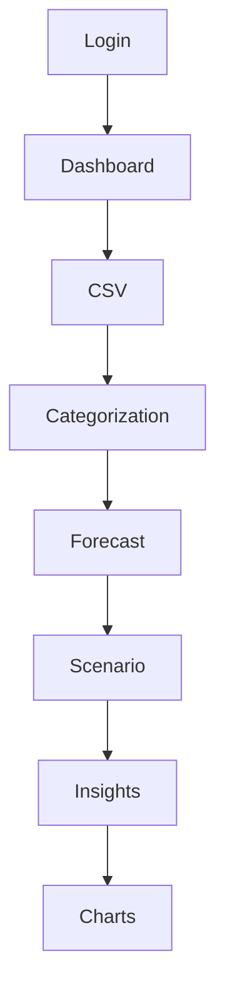

# FutureFlow Functional Requirements Specification

**Version:** 1.0  
**Project:** FutureFlow – Predictive Cash Flow & Scenario Planner

## 1. Purpose

Defines the functional behavior required of FutureFlow and serves as the implementation and testing baseline.

## 2. Actors

| Actor | Responsibilities |
| --- | --- |
| User | Manage finances, scenarios, goals and forecasts. |
| Administrator | Maintain application configuration (future). |
| Local AI Service | Categorize transactions and generate insights. |

## FR-100 User Authentication

- Register
- Login with JWT
- Change password

## FR-200 Dashboard

- Show balances
- Show forecast
- Show recurring bills
- Show AI insights

## FR-300 Transaction Management

- Import CSV
- CRUD transactions
- Auto-categorize
- Manual override

## FR-400 Forecasting

- 6–12 month cash-flow
- 5–10 year projection
- Negative balance alerts

## FR-500 Scenario Planning

- Multiple scenarios
- Salary/mortgage/401(k) changes
- Real-time comparison

## FR-600 Goal Envelopes

- Create goals
- Dynamic monthly recommendations

## FR-700 Subscription Manager

- Detect recurring charges
- Identify price increases

## FR-800 AI Insights

- Natural-language insights
- Fallback to rules if AI unavailable

## FR-900 Reporting

- Export summaries
- Generate forecast reports

## Mermaid Workflow Diagram

## Acceptance Criteria

- Forecast recalculates immediately after financial changes.
- Scenario edits do not modify baseline data.
- Application functions without local AI.
- CSV validation reports malformed records.
