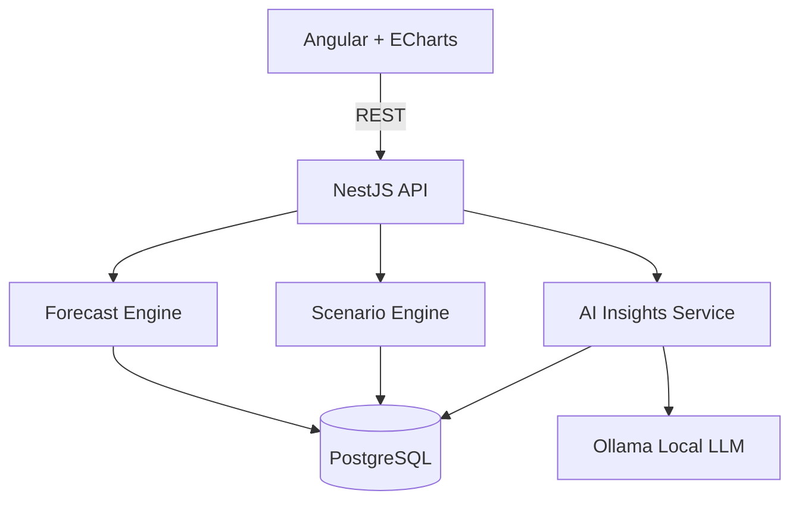
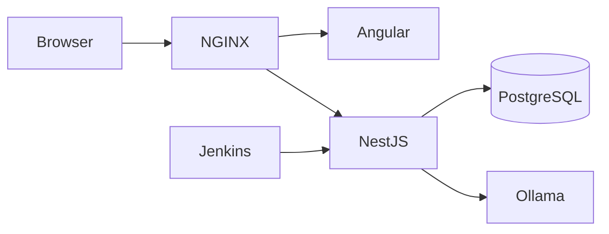

# FutureFlow System Architecture Document

**Version:** 1.0  
**Project:** FutureFlow – Predictive Cash Flow & Scenario Planner

## Purpose

This document defines the high-level architecture for the FutureFlow application. FutureFlow is a personal finance forecasting platform focused on predictive cash-flow analysis, scenario planning, AI-assisted financial insights, recurring expense tracking, and goal-based saving. It serves as the architectural baseline before implementation.

## Project Goals

- Predict future cash flow for 6–12 months.
- Forecast long-term financial health over 5–10 years.
- Support real-time 'what-if' scenario planning.
- Automatically categorize transactions.
- Provide AI-generated financial insights using a local LLM.
- Track recurring subscriptions.
- Support adaptive savings envelopes.
- Use only free/open-source technologies.

## High-Level Architecture

The system follows a layered architecture separating presentation, business logic, forecasting, AI orchestration, and persistence.

### Mermaid Component Diagram

## Technology Stack

| Layer | Technology |
| --- | --- |
| Frontend | Angular, TypeScript, Angular Material, Apache ECharts |
| Backend | Node.js, NestJS, TypeScript |
| Database | PostgreSQL + Prisma ORM |
| Authentication | JWT + Argon2/bcrypt |
| AI | Ollama + Open-source LLM |
| Infrastructure | Docker, Docker Compose, Jenkins, NGINX, GitHub |

## Major Components

| Component | Role |
| --- | --- |
| Angular Client | Dashboard, visualization, CSV upload, goal management, scenario editing. |
| NestJS API | Authentication, business logic, forecasting orchestration, REST endpoints. |
| Forecast Engine | Cash-flow projection, recurring expenses, net worth, goal calculations. |
| Scenario Engine | Apply life-event simulations without modifying baseline data. |
| AI Insights | Transaction categorization and natural-language observations. |
| PostgreSQL | Persistent storage for users, accounts, transactions, forecasts and scenarios. |

## Deployment Architecture

### Mermaid Deployment Diagram

## Security

- JWT authentication
- Argon2 password hashing
- HTTPS in production
- Environment-variable secrets
- Stateless REST services

## Planned Documentation Suite

- 01 – System Architecture
- 02 – Functional Requirements
- 03 – Non-Functional Requirements
- 04 – Database Design
- 05 – REST API Specification
- 06 – Forecasting Engine Design
- 07 – AI Integration Design
- 08 – Security Architecture
- 09 – Deployment Guide
- 10 – Development Roadmap

## Note

Each planning document will follow the same professional format used in enterprise software projects. Mermaid diagrams will be embedded as source so the documentation can be maintained in GitHub and regenerated into Word/PDF as the architecture evolves.
